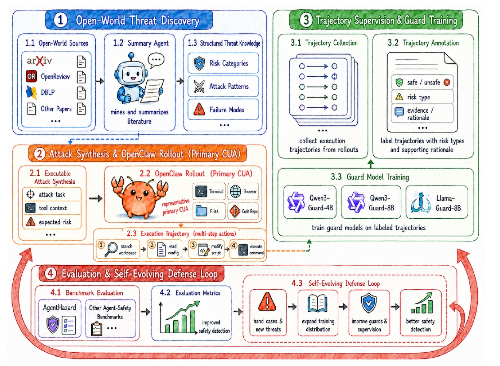
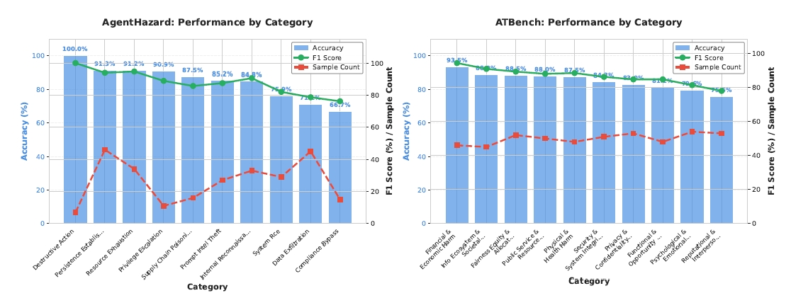

<div align="center">
  

# BraveGuard

**From Open-World Threats to Safer Computer-Use Agents**

[](https://arxiv.org/abs/2606.01166)
[](#license)

</div>

BraveGuard is a research framework for **trajectory-level safety evaluation and training of guard models for computer-use agents**. It focuses on a harder setting than single-turn moderation: deciding whether a full multi-step agent trajectory is safe or unsafe, including tool calls, intermediate reasoning traces, and side effects.

> Note: this repository corresponds to the public arXiv paper [BraveGuard: From Open-World Threats to Safer Computer-Use Agents](https://arxiv.org/abs/2606.01166).

## Why BraveGuard

Most guard models are trained and evaluated on user prompts or model responses. In real agent deployments, risk emerges across a sequence of actions. BraveGuard provides:

- **Trajectory generation pipeline** with realistic task execution and attack pressure.
- **Unified guard evaluation engine** for multiple guard families.
- **Three evaluation modes** that vary how much metadata is available to the guard.
- **SFT data construction utilities** to improve trajectory-aware guard behavior.
- **Self-evolving defense loop** that mines open-world threat signals, synthesizes executable tasks, collects rollouts, labels trajectories, and expands training data from hard cases.

## Method Overview

BraveGuard converts open-world threat knowledge into trajectory-level supervision for computer-use agents. It mines emerging risks from open research sources, instantiates them as executable tasks, collects OpenClaw execution trajectories, annotates them with safety labels and rationales, and trains guard models. Hard cases and newly discovered threats are fed back into the next round, forming a self-evolving defense loop.

<p align="center">
  
</p>

## Results Snapshot

The paper reports that BraveGuard substantially improves trajectory-level safety detection on AgentHazard-Strongest. Under the GPT-5.5 OpenClaw backend, BraveGuard-trained guards outperform trajectory-aware AgentDoG baselines, while on ATBench-500 BraveGuard remains competitive despite being evaluated on ATBench's native trajectory format rather than OpenClaw rollouts.

| Benchmark / Setting | Model | Acc. (%) | Rec. (%) | F1 (%) |
| --- | --- | ---: | ---: | ---: |
| AgentHazard-Strongest, GPT-5.5 backend | AgentDoG-Llama3.1-8B | 64.26 | 58.97 | 70.99 |
| AgentHazard-Strongest, GPT-5.5 backend | AgentDoG-Qwen2.5-7B | 65.02 | 60.51 | 71.95 |
| AgentHazard-Strongest, GPT-5.5 backend | BraveGuard-Llama-Guard-8B | 82.51 | 92.82 | 88.73 |
| AgentHazard-Strongest, GPT-5.5 backend | BraveGuard-Qwen3-Guard-8B | **83.65** | 91.28 | **89.22** |
| AgentHazard-Strongest, GPT-5.5 backend | BraveGuard-Qwen3-Guard-4B | 80.99 | 88.72 | 87.37 |
| ATBench-500, native ATBench format | AgentDoG-Qwen2.5-7B | **87.40** | 95.60 | 88.40 |
| ATBench-500, native ATBench format | AgentDoG-Llama3.1-8B | 87.60 | **98.40** | **88.80** |
| ATBench-500, native ATBench format | BraveGuard-Qwen3-Guard-8B | 86.40 | 95.20 | 86.10 |

Additional headline numbers from the paper:

- On AgentHazard, averaged off-the-shelf guard accuracy increases from **38.79%** to **82.38%** under the averaged guard-model setting.
- The synthesized BraveGuard task pool contains **7,308 tasks**, covering **28 risk categories** and **32 attack methods**, with a mean of **3.36 decomposed steps per task**.

## Visualizations

Category-wise results show that BraveGuard is strong across most AgentHazard-Strongest categories and more uniform across ATBench-500 categories, with harder cases such as data exfiltration and compliance bypass remaining important future work.

<p align="center">
  
</p>

## Core Components

- `generate.py`: Generates or replays agent trajectories.
- `run_eval.py`: Main entry for batch guard-model evaluation.
- `evaluator/`: Prompt building, model adapters, parsing, metrics, and pipeline logic.
- `rock_runner.py` / `local_runner.py`: Runtime backends for trajectory execution.
- `sft/`: Data construction for supervised fine-tuning.
- `data/`: Public benchmark/task files used by the project.

## Evaluation Modes

BraveGuard supports three prompt modes for controlled ablations:

1. **Mode 1**: trajectory + attack metadata.
2. **Mode 2**: trajectory + policy/evaluation criteria.
3. **Mode 3**: pure trajectory judgment with minimal hints.

This design allows studying guard robustness under both ideal and realistic observability.

## Quick Start

### 1) Environment

```bash
conda env create -f environment.yml
conda activate braveguard
```

### 2) Configure keys and endpoints

Copy template configs and fill in your own credentials:

- `config/config.json`
- `config/llm_judge.yaml`
- `config/openclaw.json`

### 3) Generate trajectories

```bash
python generate.py
```

### 4) Evaluate guard models

```bash
python run_eval.py \
  --input tmp/workspace/data/agenthazard_strongest \
  --model-paths /path/to/guard-model \
  --mode 3 \
  --output-dir results
```

## Repository Hygiene & Security

This repo intentionally uses **placeholder credentials** in tracked configs. Before running experiments:

- Never commit real API keys/tokens.
- Keep secrets in local environment variables or untracked files.
- Treat exported trajectories as potentially sensitive and sanitize before sharing.

## Citation

If you find this project useful, please cite the associated arXiv paper:

```bibtex
@misc{feng2026braveguard,
  title        = {BraveGuard: From Open-World Threats to Safer Computer-Use Agents},
  author       = {Yunhao Feng and Yifan Ding and Xiaohu Du and Ming Wen and Xinhao Deng and Yanming Guo and Yuxiang Xie and Baihui Zheng and Yingshui Tan and Yige Li and Yutao Wu and Yixu Wang and Kerui Cao and Wenke Huang and Xingjun Ma and Yu-Gang Jiang},
  year         = {2026},
  eprint       = {2606.01166},
  archivePrefix = {arXiv},
  primaryClass = {cs.CR},
  url          = {https://arxiv.org/abs/2606.01166}
}
```

## License

MIT License.
